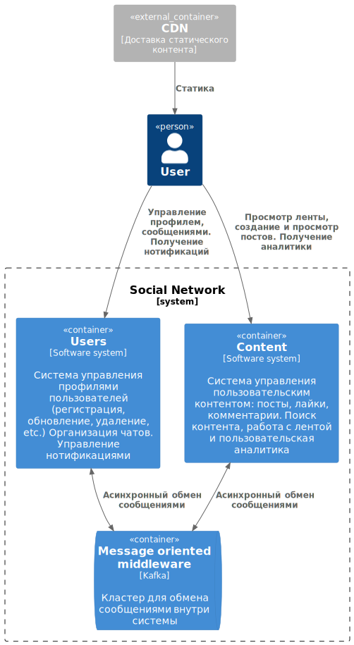
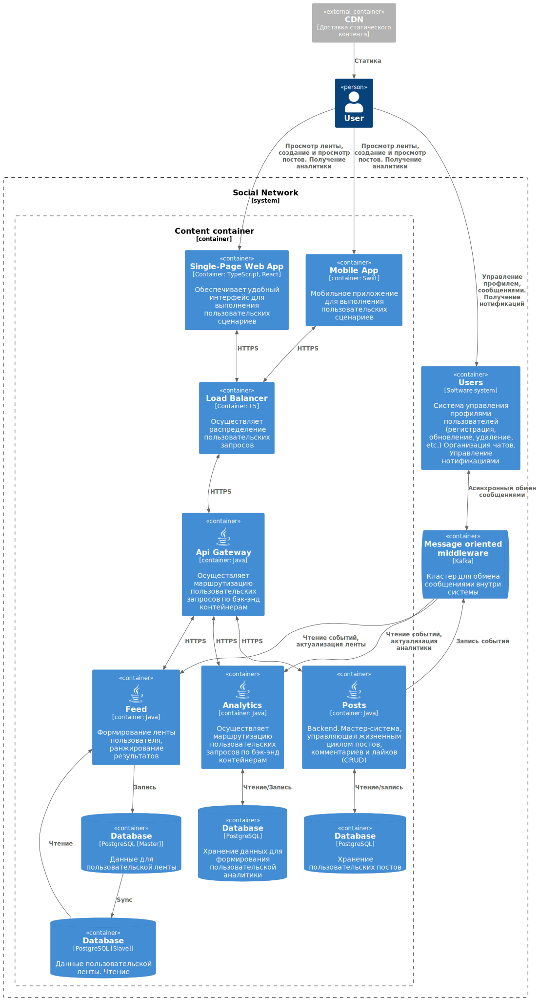

# RFC: Alter - the coolest social network
## Резюме
Данный документ представляет собой архитектуру (дизайн) социальной сети - распределенного приложения, рассчитанного на
серьезный уровень нагрузок и отказоустойчивости. 

## Мотивация
В настоящий момент на рынке сложилась ситуация, когда из любого продукта стараются сделать "суперапп", который
будет включать в себя "все" - от банковского приложения до заказа пиццы. Данный тренд не устраивает нас (команду Alter),
и мы фокусируется на проектировании продукта, решающего конкретную задачу: объединение единомышленников, общение, мемы 
и котики.

### Расчеты нагрузки
RPS Чтение

    DAU = 30_000_000 
    40 чтений в день
    RPS = 30_000_000 * 40 / 86_400 ~= 13_900 rps
    Peak Multiplier (PM) = 2.5
    Off-Peak Multiplier (OM) = 0.5
    Max RPS = 13_900 * 2.5 = 34_750
    Min RPS = 13_900 * 0.5 = 6_950

RPS Запись

    DAU = 30 000 000
    20 записей в день
    RPS = 30 000 000 * 20 / 86 400 ~= 6 950 rps
    Peak Multiplier (PM) = 2.5
    Off-Peak Multiplier (OM) = 0.5
    Max RPS = 6_950 * 2.5 = 17_375
    Min RPS = 6_950 * 0.5 = 3_475

### Детальное описание и архитектура
Для описания реализации системы будет использована нотация C4 и представлены уровни С1 и С2

    <b>Level С1.</b> System context diagram

  

    <b>Level С2.</b> Container diagram

  

